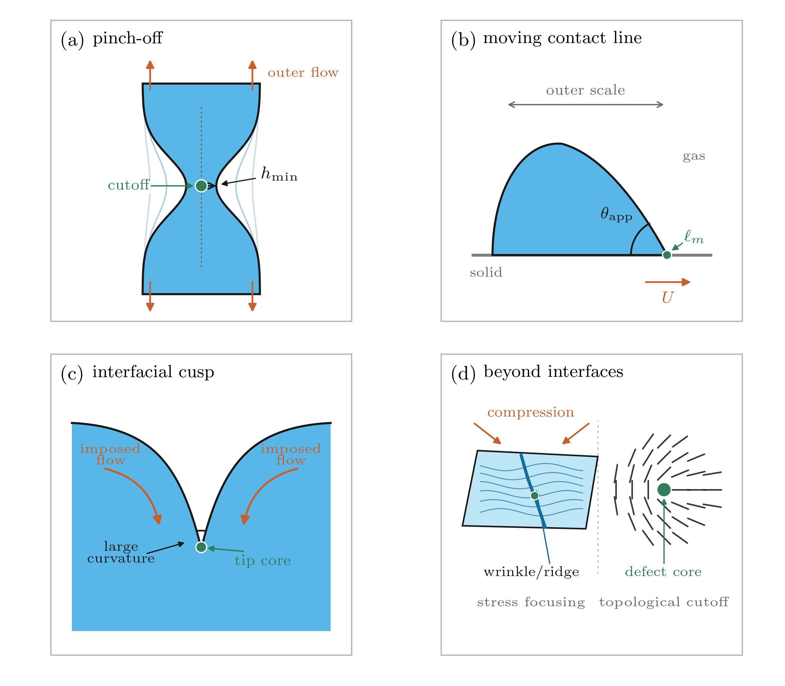
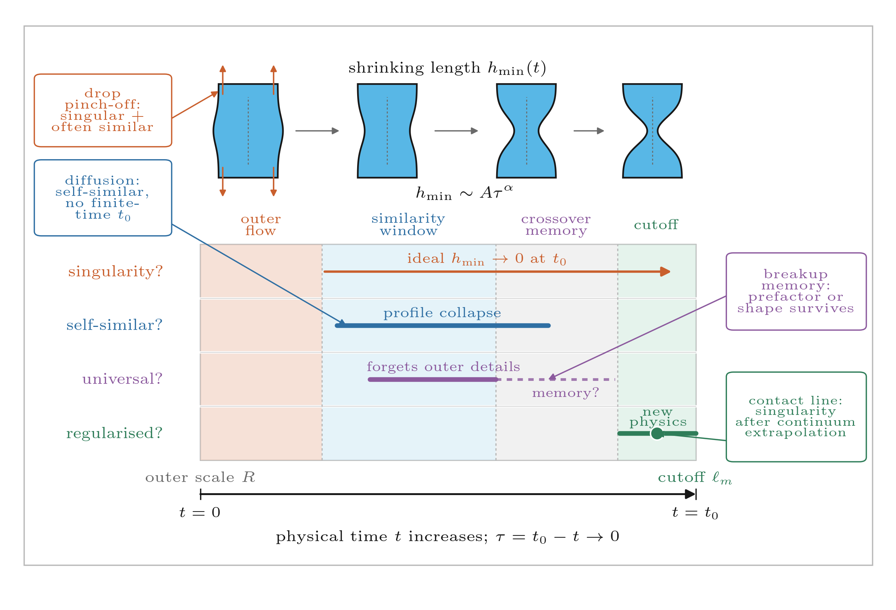
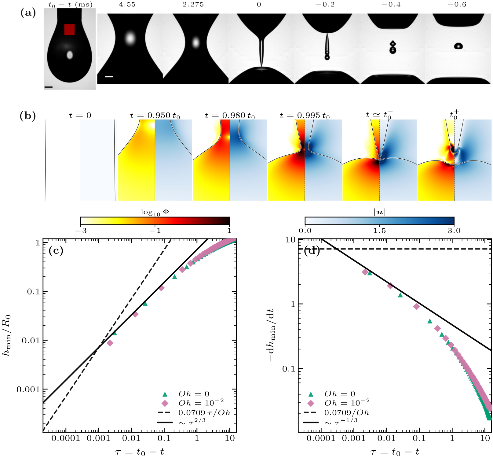
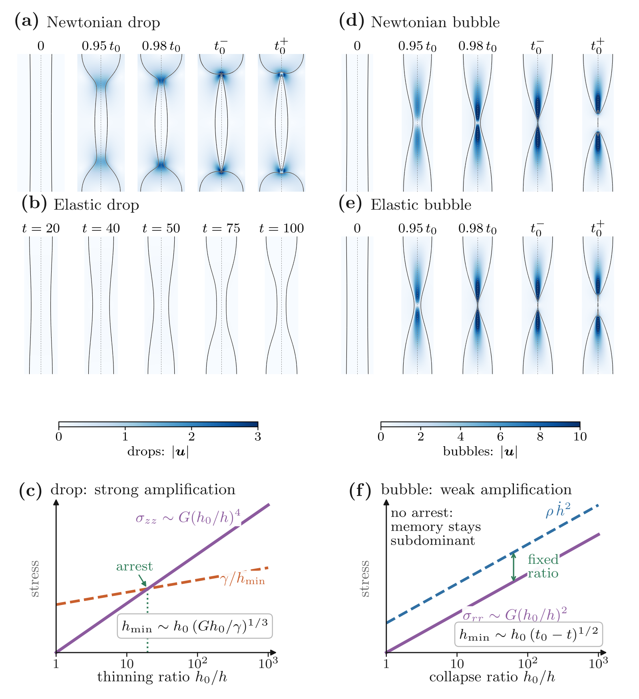
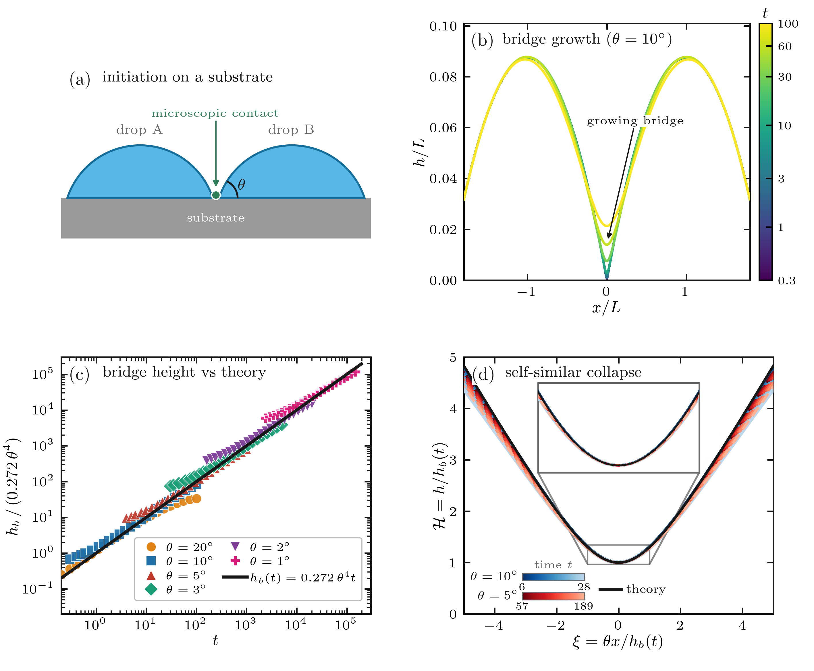
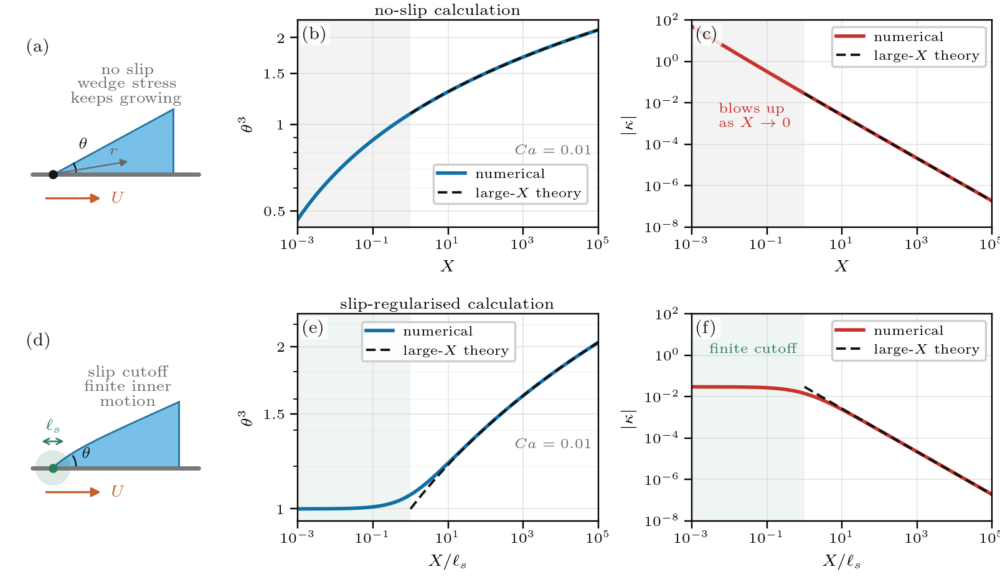
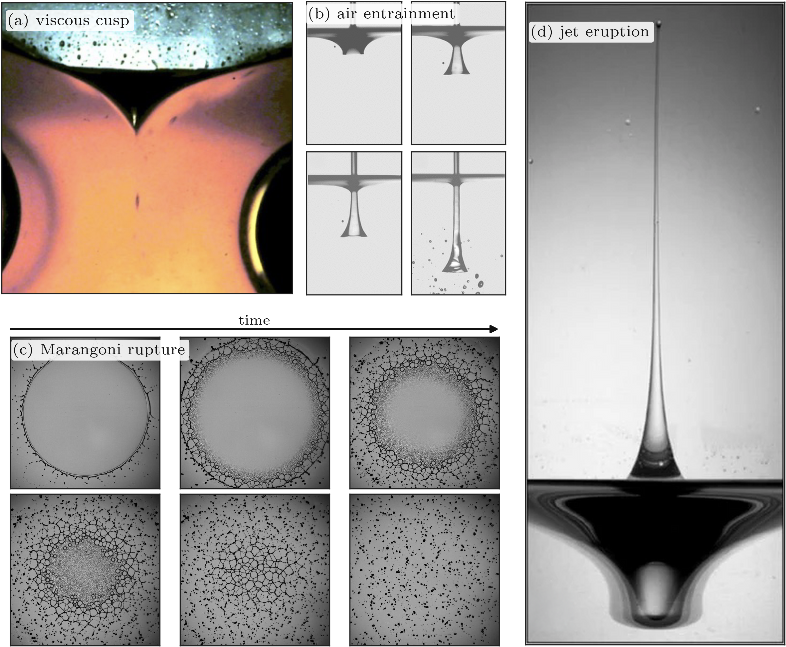
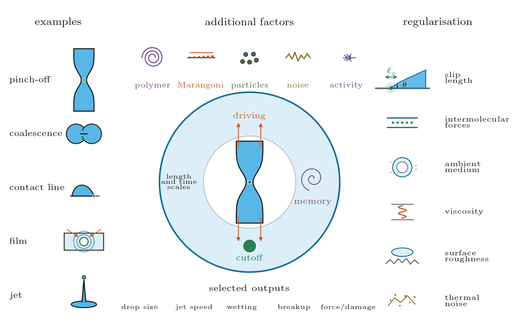

# Soft Matter Singularities Paper Figures

Figure-generation scripts, curated data, rendered panels, and final figure
exports for the review paper *Singularities in Soft Matter Systems*.

This repository is intended to be used as the `figures/` submodule of
[`VatsalSy/Soft-Matter-Singularities_paper`](https://github.com/VatsalSy/Soft-Matter-Singularities_paper).
It is also usable on its own: all commands below are run from this `figures/`
repository root, not from the parent paper repository.

## Quick start

Rebuild all eight figure PDFs and PNG previews:

```bash
make figures
```

Rebuild one figure:

```bash
make fig6
```

Check embedded PDF fonts:

```bash
make check-fonts
```

The `Makefile` uses `uv` when it is available, so a clean machine can run the
figure scripts without first creating a local virtual environment:

```bash
uv run --with matplotlib --with numpy --with scipy --with pillow --with pypdf python scripts/rebuild_all_figures.py
```

If `uv` is not available, install the same Python packages into the active
Python environment before running `make`. The rebuild also needs Poppler tools
on `PATH`: `pdftoppm` for PNG previews and `pdffonts` for font checks.

## Figure catalogue

| Figure | Preview | Rebuild command | Main source |
|---|---|---|---|
| 1. Visual dictionary |  | `make fig1` | `make_fig1_visual_dictionary.py` |
| 2. Conceptual toolkit |  | `make fig2` | `make_fig2_conceptual_toolkit.py` |
| 3. Drop pinch-off |  | `make fig3` | `make_fig3_drop_pinch.py` |
| 4. Drop and bubble pinch-off |  | `make fig4` | `make_fig4_drop_bubble.py` |
| 5. Coalescence |  | `make fig5` | `fig5_coalescence_src/make_fig5_coalescence.py` |
| 6. Contact lines |  | `make fig6` | `make_fig6_contact_line.py` |
| 7. Focusing and outputs |  | `make fig7` | `make_fig7_focusing_output.py` |
| 8. Broader soft-matter family |  | `make fig8` | `make_fig8_broad_family.py` |

## Repository layout

- `fig1_visual_dictionary.*` through `fig8_broad_family.*`: final figure exports
  used by the manuscript.
- `make_fig*.py`: top-level figure-generation scripts.
- `scripts/rebuild_all_figures.py`: rebuild driver used by `make figures`.
- `fig3_drop_pinch/`: curated Figure 3 panels, reduced pinch-off data, and
  optional raw-panel renderers.
- `fig4_drop_bubble/`: curated Figure 4 panels, manifests, scales, and optional
  raw-panel renderers.
- `fig5_coalescence_data/` and `fig5_coalescence_src/`: Figure 5 numerical data
  and plotting scripts.
- `fig7_rawimages/`: source images and extracted movie frames used in Figure 7.
- `RAW_DATA_MANIFEST.md`: provenance notes for raw simulations and image sources
  that are too large or external to this repository.

## Data and provenance

The repository tracks the publication-facing PDFs/PNGs and the curated data
needed to rebuild the eight figures. For large Basilisk simulations, the raw
field dumps are not stored in git. Instead, the repo keeps the reduced data,
rendered tight panels, per-case `manifest.csv` files, and `scales.txt` files
needed for the manuscript figures. The larger raw-data locations and archive
status are documented in `RAW_DATA_MANIFEST.md`.

Figure 3 is portable by default: when the raw simulation logs are absent,
`make_fig3_drop_pinch.py` rebuilds the plotted curves from the tracked reduced
CSV data in `fig3_drop_pinch/data/`.
